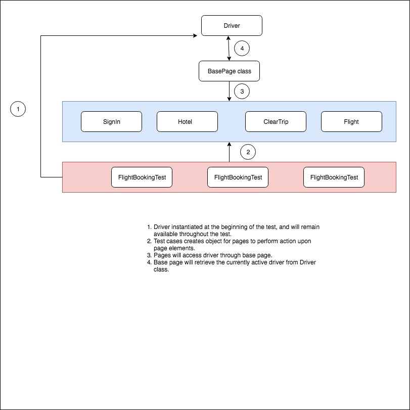

# TestVagrant hiring challenge for applicants 
### Code review

* Liner frameworks is easy to understand, need to updated it other framework.
* try "not" to hard code the values inside script file. should make it to read from excel or some data file.
	( For eg: "https://www.cleartrip.com/", "Delhi")
* Could have added functionality to handle Multiple browser.
* Could have moved reusable methods like "setDriverPath" to common file, so that we can have less maintainability.

**FlightBookingTest.java**

- waitFor(2000);
* using static timeout would lead to flaky test, we should use methods 'waitForElement' instead

- driver.findElement(By.id("OneWay")).click();
* Selenium Actions could be moved to separate files, for maintainability,
* Locators could be moved to separate files(POM), where elements are reused and maintained easily

- driver.findElement(By.xpath("//*[@id='ui-datepicker-div']/div[1]/table/tbody/tr[3]/td[7]/a")).click();
* can avoid index, Since they have greater probability of change, during enhancements

- Assert.assertTrue(isElementPresent(By.className("searchSummary")));
* can have some comment messages on failures, which will make others to understand the failures. also help reports more readable

- private void waitFor(int durationInMilliSeconds) {
        try {
            Thread.sleep(durationInMilliSeconds);
        } catch (InterruptedException e) {
            e.printStackTrace();  //To change body of catch statement use File | Settings | File Templates.
        }
    }

* could have designed this method to wait for element, instead static wait shoudl move to some resuable folder

private boolean isElementPresent(By by) {
        try {
            driver.findElement(by);
            return true;
        } catch (NoSuchElementException e) {
            return false;
        }
    }

* Though this method Looks good, could have added default parameter to handle wait also raise 

**HotelBookingTest.java**

- WebDriver driver = new ChromeDriver();
* should initialise in common component 

- localityTextBox.sendKeys("Indiranagar, Bangalore");
could have read values from data sheets, or other mode

**SignInTest.java**

- driver.quit();
on the test files will kill the driver, which will drivers unavailable for other tests.
-  WebDriver driver = new ChromeDriver();
Should be in @Beforeall Annotation

**Technology stack:** *Java, Selenium, TestNG, Maven*

I wanted this framework to be more maintainable and reliable.   
  - Have categorize page element & reusable from test script.
  - Used floating driver for more maintainability
  - Removed static timeouts.

I have modified the script with following changes

 **Files Added:**
- /codoingRound/src/main/java/library/BasePage.java
- /codoingRound/src/main/java/library/Driver.java
- /codoingRound/src/main/java/pages/ClearTrip.java
- /codoingRound/src/main/java/pages/Flight.java
- /codoingRound/src/main/java/pages/Hotel.java
- /codoingRound/src/main/java/pages/SignIn.java

**Files Modified:**
- /codoingRound/src/main/java/FlightBookingTest.java
- /codoingRound/src/main/java/HotelBookingTest.java
- /codoingRound/src/main/java/SignInTest.java
	

**Road map items (Features):**
> Generate test report
> Email report to the team
> log results into Test management tools.
> Facilitate to test API.
> Facilitate to test services.
> Facilitate to Mock services.
> Find and ignore flaky tests.

 
ref: https://subscription.packtpub.com/book/web_development/9781788473576/1/ch01lvl1sec11/the-singleton-driver-class
 